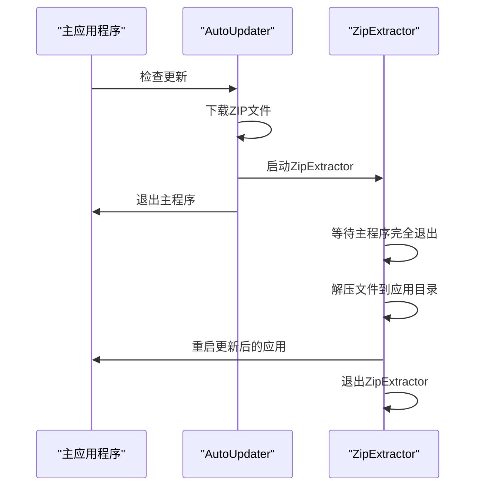

您询问的是AutoUpdater.NET如何解决程序运行时文件被锁定的问题。<cite/>

## 文件锁定问题的解决方案

AutoUpdater.NET通过使用独立的`ZipExtractor`工具来巧妙地解决这个问题：<cite/>

### 1. 独立进程机制

当需要进行ZIP格式的更新时，AutoUpdater.NET会启动一个独立的`ZipExtractor.exe`进程 [1](#1-0) 。这个工具是作为资源嵌入在主库中的，使用时会被提取到临时位置 [2](#1-1) 。

### 2. 等待主程序退出

ZipExtractor启动后，首先会等待原始应用程序完全退出 [3](#1-2) 。它通过进程名称查找所有相关进程，并调用`process.WaitForExit()`来确保主程序已经完全关闭 [4](#1-3) 。

### 3. 文件锁定检测和处理

即使主程序已退出，某些文件仍可能被其他进程锁定。ZipExtractor实现了智能的文件锁定处理机制 [5](#1-4) ：

- **重试机制**：当遇到文件锁定时，最多重试2次
- **锁定进程识别**：在Windows Vista及以上版本中，使用`FileUtil.WhoIsLocking()`识别锁定文件的进程 [6](#1-5) 
- **用户交互**：如果发现锁定进程，会显示对话框提示用户手动关闭相关进程 [7](#1-6) 

### 4. 错误处理

ZipExtractor专门处理文件共享冲突和锁定冲突的IOException [8](#1-7) ：

```csharp
const int errorSharingViolation = 0x20;
const int errorLockViolation = 0x21;
```

### 5. 应用程序重启

文件解压完成后，ZipExtractor会重新启动更新后的应用程序 [9](#1-8) ，然后自己退出 [10](#1-9) 。

## 整体流程



## Notes

这种设计的核心思想是**进程分离**：通过独立的进程来处理文件更新，避免了自我更新的文件锁定问题。对于MSI/EXE安装程序，AutoUpdater.NET直接运行安装程序 [11](#1-10) ，由安装程序本身处理文件替换逻辑。

Wiki pages you might want to explore:
- [Getting Started (ravibpatel/AutoUpdater.NET)](/wiki/ravibpatel/AutoUpdater.NET#2)
- [Core Components (ravibpatel/AutoUpdater.NET)](/wiki/ravibpatel/AutoUpdater.NET#3)
- [ZipExtractor Utility (ravibpatel/AutoUpdater.NET)](/wiki/ravibpatel/AutoUpdater.NET#3.3)

### Citations

**File:** AutoUpdater.NET/DownloadUpdateDialog.cs (L168-172)
```csharp
                string installerPath =
                    Path.Combine(Path.GetDirectoryName(tempPath) ?? throw new InvalidOperationException(),
                        "ZipExtractor.exe");

                File.WriteAllBytes(installerPath, Resources.ZipExtractor);
```

**File:** AutoUpdater.NET/DownloadUpdateDialog.cs (L226-237)
```csharp
            else if (extension.Equals(".msi", StringComparison.OrdinalIgnoreCase))
            {
                processStartInfo = new ProcessStartInfo
                {
                    FileName = "msiexec",
                    Arguments = $"/i \"{tempPath}\""
                };

                if (!string.IsNullOrEmpty(installerArgs))
                {
                    processStartInfo.Arguments += $" {installerArgs}";
                }
```

**File:** ZipExtractor/FormMain.cs (L85-95)
```csharp
            foreach (Process process in Process.GetProcessesByName(Path.GetFileNameWithoutExtension(currentExe)))
            {
                try
                {
                    if (process.MainModule is { FileName: not null } && process.MainModule.FileName.Equals(currentExe))
                    {
                        _logBuilder.AppendLine("Waiting for application process to exit...");

                        _backgroundWorker.ReportProgress(0, Resources.WaitingForAppToExitMessage);
                        process.WaitForExit();
                    }
```

**File:** ZipExtractor/FormMain.cs (L195-247)
```csharp
                        catch (IOException exception)
                        {
                            const int errorSharingViolation = 0x20;
                            const int errorLockViolation = 0x21;
                            int errorCode = Marshal.GetHRForException(exception) & 0x0000FFFF;
                            if (errorCode is not (errorSharingViolation or errorLockViolation))
                            {
                                throw;
                            }

                            retries++;
                            if (retries > MaxRetries)
                            {
                                throw;
                            }

                            List<Process> lockingProcesses = null;
                            if (Environment.OSVersion.Version.Major >= 6 && retries >= 2)
                            {
                                try
                                {
                                    lockingProcesses = FileUtil.WhoIsLocking(filePath);
                                }
                                catch (Exception)
                                {
                                    // ignored
                                }
                            }

                            if (lockingProcesses == null)
                            {
                                Thread.Sleep(5000);
                                continue;
                            }

                            foreach (Process lockingProcess in lockingProcesses)
                            {
                                var dialogResult = DialogResult.None;

                                Invoke(new Action(() =>
                                {
                                    dialogResult = MessageBox.Show(this,
                                        string.Format(Resources.FileStillInUseMessage,
                                            lockingProcess.ProcessName, filePath),
                                        Resources.FileStillInUseCaption,
                                        MessageBoxButtons.RetryCancel, MessageBoxIcon.Error);
                                }));

                                if (dialogResult == DialogResult.Cancel)
                                {
                                    throw;
                                }
                            }
```

**File:** ZipExtractor/FormMain.cs (L293-302)
```csharp
                    string executablePath = string.IsNullOrWhiteSpace(updatedExe)
                        ? currentExe
                        : Path.Combine(extractionPath, updatedExe);
                    var processStartInfo = new ProcessStartInfo(executablePath);
                    if (!string.IsNullOrEmpty(commandLineArgs))
                    {
                        processStartInfo.Arguments = commandLineArgs;
                    }

                    Process.Start(processStartInfo);
```

**File:** ZipExtractor/FormMain.cs (L325-325)
```csharp
                Application.Exit();
```


您询问的是启动独立进程的具体代码位置。<cite/>

## 启动ZipExtractor进程的代码

启动独立进程的核心代码位于`DownloadUpdateDialog.cs`文件中的下载完成处理逻辑里。 [1](#2-0) 

当检测到更新文件是ZIP格式时，系统会执行以下步骤：

### 1. 提取ZipExtractor.exe

首先将嵌入的`ZipExtractor.exe`资源文件写入到临时目录： [2](#2-1) 

### 2. 构建命令行参数

系统会构建传递给ZipExtractor的命令行参数，包括输入ZIP文件路径、输出目录、当前可执行文件路径等： [3](#2-2) 

### 3. 启动独立进程

最终通过`Process.Start()`启动ZipExtractor进程： [4](#2-3) 

## 进程启动的完整流程

整个启动流程是这样的：

1. 用户点击更新按钮后，`DownloadUpdateDialog`开始下载更新文件
2. 下载完成后，在`WebClientDownloadFileCompleted`事件处理器中检查文件扩展名
3. 如果是`.zip`文件，就执行上述的ZipExtractor启动逻辑
4. 如果是`.msi`文件，则直接使用`msiexec`启动： [5](#2-4) 

## Notes

这个设计巧妙地解决了自我更新的文件锁定问题：主程序启动独立的ZipExtractor进程后就可以安全退出，而ZipExtractor会等待主程序完全退出后再进行文件替换操作。对于MSI/EXE安装程序，则直接依赖安装程序本身的文件替换机制。

Wiki pages you might want to explore:
- [Core Components (ravibpatel/AutoUpdater.NET)](/wiki/ravibpatel/AutoUpdater.NET#3)

### Citations

**File:** AutoUpdater.NET/DownloadUpdateDialog.cs (L165-172)
```csharp
            string extension = Path.GetExtension(tempPath);
            if (extension.Equals(".zip", StringComparison.OrdinalIgnoreCase))
            {
                string installerPath =
                    Path.Combine(Path.GetDirectoryName(tempPath) ?? throw new InvalidOperationException(),
                        "ZipExtractor.exe");

                File.WriteAllBytes(installerPath, Resources.ZipExtractor);
```

**File:** AutoUpdater.NET/DownloadUpdateDialog.cs (L196-224)
```csharp
                var arguments = new Collection<string>
                {
                    "--input",
                    tempPath,
                    "--output",
                    extractionPath,
                    "--current-exe",
                    currentExe
                };

                if (!string.IsNullOrWhiteSpace(updatedExe))
                {
                    arguments.Add("--updated-exe");
                    arguments.Add(updatedExe);
                }

                if (AutoUpdater.ClearAppDirectory)
                {
                    arguments.Add("--clear");
                }

                string[] args = Environment.GetCommandLineArgs();
                if (args.Length > 1)
                {
                    arguments.Add("--args");
                    arguments.Add(string.Join(" ", args.Skip(1).Select(arg => $"\"{arg}\"")));
                }

                processStartInfo.Arguments = Utils.BuildArguments(arguments);
```

**File:** AutoUpdater.NET/DownloadUpdateDialog.cs (L226-238)
```csharp
            else if (extension.Equals(".msi", StringComparison.OrdinalIgnoreCase))
            {
                processStartInfo = new ProcessStartInfo
                {
                    FileName = "msiexec",
                    Arguments = $"/i \"{tempPath}\""
                };

                if (!string.IsNullOrEmpty(installerArgs))
                {
                    processStartInfo.Arguments += $" {installerArgs}";
                }
            }
```

**File:** AutoUpdater.NET/DownloadUpdateDialog.cs (L245-247)
```csharp
            try
            {
                Process.Start(processStartInfo);
```


```
<?xml version="1.0" encoding="UTF-8"?>
<item>
	<version>2.0.0.0</version>
	<url>https://rbsoft.org/downloads/AutoUpdaterTest.zip</url>
	<changelog>https://github.com/ravibpatel/AutoUpdater.NET/releases</changelog>
	<mandatory>false</mandatory>
</item>
```